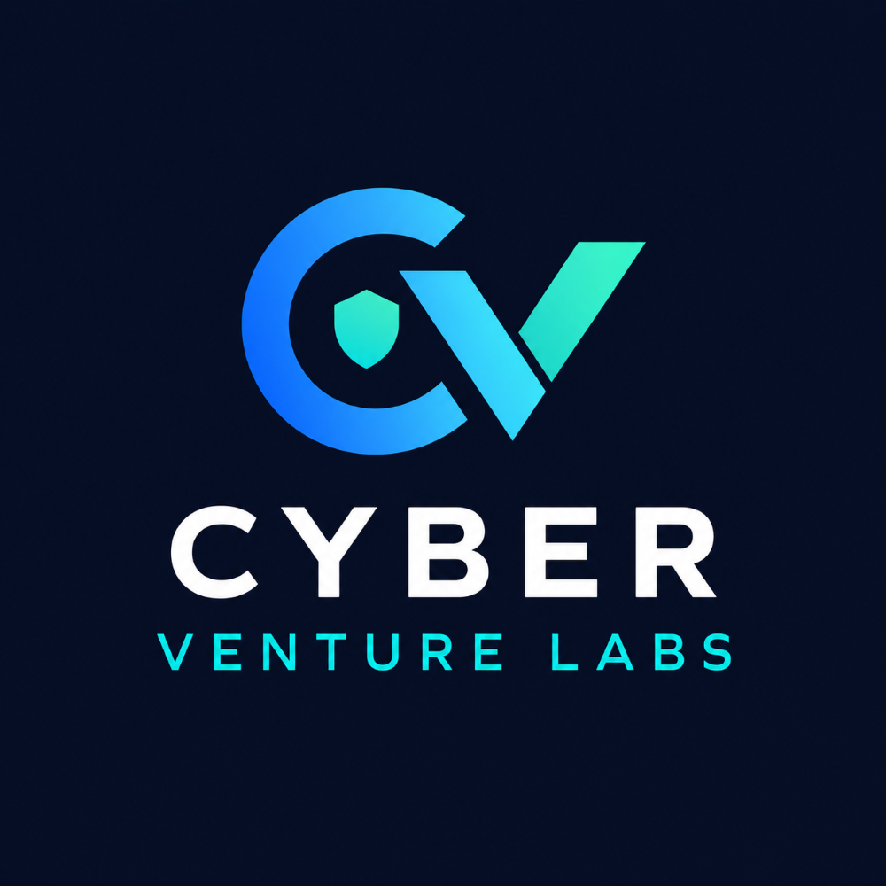

# Cyber Venture Labs

**Building secure, trustworthy technology: from first idea to launch.**

---

## 👋 About Us

Cyber Venture Labs is a venture studio focused on cybersecurity. We turn promising ideas into real products by combining security-first engineering with a builder's mindset: prototype fast, validate early, and ship software people can trust.

> 🛡️ Security isn't a feature we add at the end. It's where we start.

## 🔭 What We Do

- **Build:** prototype and develop new security-focused tools and platforms
- **Research:** explore emerging threats, technologies, and defensive approaches
- **Open source:** share useful tooling and learnings with the community
- **Collaborate:** partner with engineers, researchers, and founders on ambitious ideas

## 🧪 Focus Areas

| Area | What it covers |
| --- | --- |
| 🔐 Product & Application Security | Secure design, vulnerability management, and response |
| 📊 Data & Cloud Security | Protecting data pipelines and cloud-native systems |
| 🤖 Security Automation | Tooling that reduces manual effort in detection and response |
| 🧭 Governance & Risk | Frameworks and processes that make security repeatable |

## 📦 Repositories

Our public repositories will appear here as projects are released. Watch this space.

<!-- Example once repos are public:
| Project | Description |
| --- | --- |
| [project-name](https://github.com/Cyber-Venture-Labs/project-name) | One-line description |
-->

## 🤝 Get Involved

- ⭐ Star and watch repositories you find useful
- 🐛 Open an issue to report bugs or suggest improvements
- 🔧 Submit a pull request. Contribution guidelines will live in each repository's `CONTRIBUTING.md`
- 🔒 Found a security issue? Please report it privately via the repository's **Security** tab rather than opening a public issue

## 📬 Contact

- 🌐 Website: _coming soon_
- ✉️ Email: _add contact address_
- 💼 LinkedIn: _add link_

---

© Cyber Venture Labs. All rights reserved.

